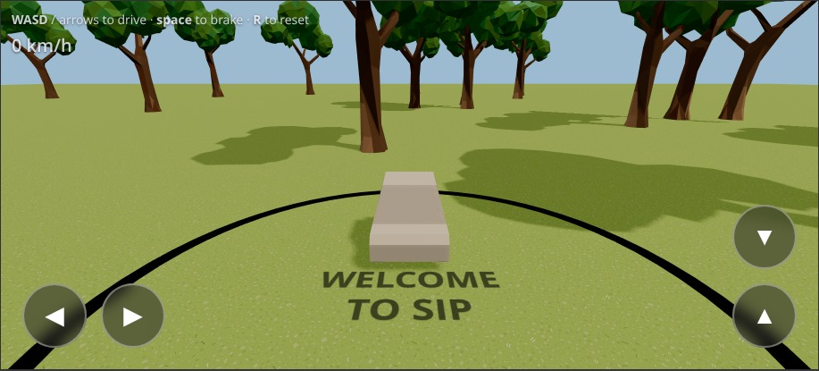

# Student Induction Program Game


## Run

```sh
npm install
npm run dev
```

## Controls

- **Desktop:** WASD / arrows to drive, space to brake, R to reset.
- **Mobile:** on-screen buttons appear on touch devices.

## Swapping primitives for 3D models

1. Drop `.glb` / `.gltf` files into [`public/models/`](public/models/).
2. Register them in [`src/manifest.ts`](src/manifest.ts):

   ```ts
   export const PREFABS = {
     car: { model: "/models/car.glb" },
     obstacle_rock: { model: "/models/rock.glb", mass: 8 },
   } satisfies Record<string, PrefabDef>;
   ```

3. `npm run dev` — the primitives are swapped in place.

**Naming:** key `car` = player. Keys starting with `obstacle_` = random obstacle pool.

**Optional per-entry:** `scale`, `rotation`, `visualOffset`, `collider.size`, `collider.offset`, `mass`. See the comment at the top of `src/manifest.ts` for the full reference.

**Collider fallback order:** manifest `collider.size` → hidden child named `collider` in the GLB → auto AABB.

## Layout

- [`src/Assets.ts`](src/Assets.ts) — GLB loader, prefab abstraction.
- [`src/manifest.ts`](src/manifest.ts) — designer edit point.
- [`src/Car.ts`](src/Car.ts) — car visual + physics body.
- [`src/World.ts`](src/World.ts) — ground, lights, obstacle spawner.
- [`src/Physics.ts`](src/Physics.ts) — cannon-es world + contact materials.
- [`src/Input.ts`](src/Input.ts) — keyboard + touch controls.
- [`src/main.ts`](src/main.ts) — boot, loop, follow camera.

