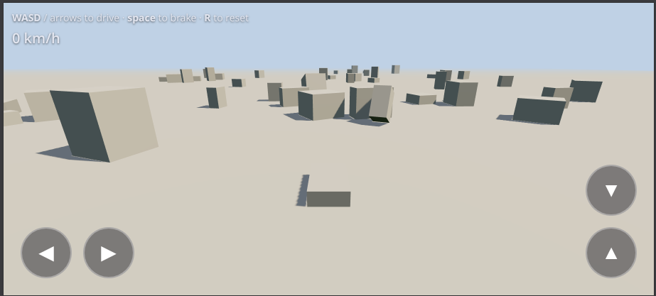
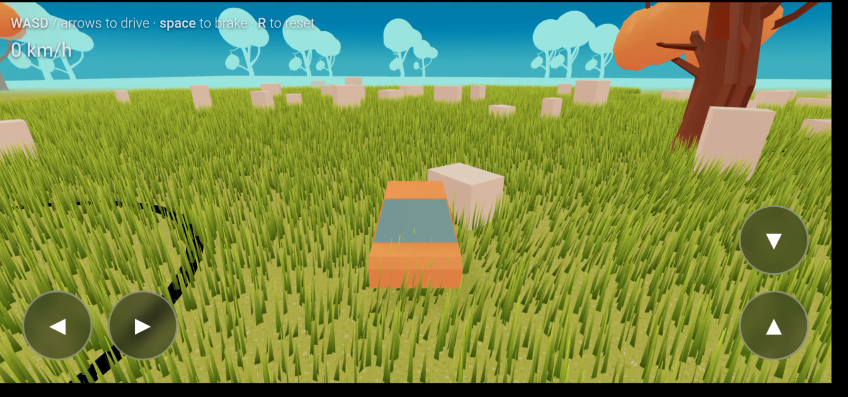
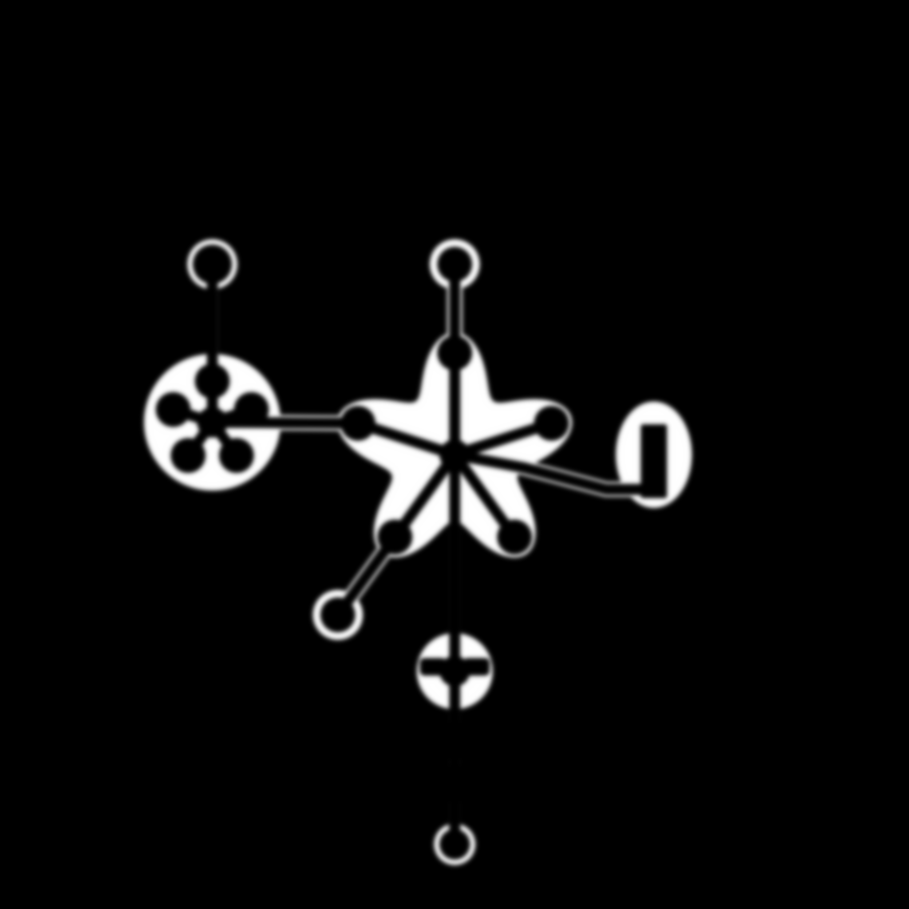
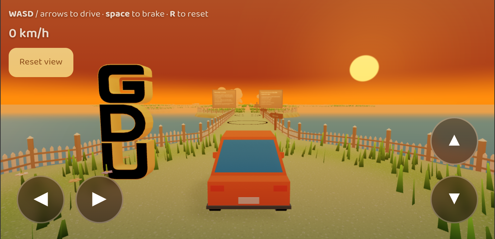

# Motivation

The motivation to make this game came from the portfolio of Bruno Simon, which features a similar concept of driving a car around a 3D terrain to explore interactive stations. As a game development club (GDU), we wanted game development itself to be the first point of contact between our community and the incoming freshman batch. Creating a custom web-based exploration game felt like the most natural way to introduce them to the craft.

# Approach

## Tech Stack Used
- **Three.js** (WebGL 3D rendering)
- **TypeScript** (Typed application logic)
- **Cannon.es** (Rigid-body physics engine)
- **GLSL** (Custom shaders for environment effects)

## Process

- **Phase 1: Baselines & Primitives**  
  We started by assembling a basic scene using primitive boxes, spheres, and plane colliders to establish a sandbox baseline for driving controls and camera behavior.

  

- **Phase 2: Scenery & Models**  
  Once driving and target follow felt right, we designed and integrated basic meshes for the car, trees, and obstacles to outline our world.

  

- **Phase 3: Visual Polish & Mobile Optimisation**  
  As we refined the art, we faced two overlapping challenges:
  1. We needed beautiful visual elements (soft grass, atmospheric shadows, ambient wildlife).
  2. The entire interactive sandbox had to run smoothly at 60 FPS on mobile browsers.

  To balance visual density with high performance, we implemented custom lightweight shaders and instanced geometry systems directly in GLSL to minimize draw calls and vertex overhead.

  

  This approach kept the engine pipeline extremely slim, leaving plenty of performance budget to support dynamic scenery and wildlife:
  - **Waving grass:** 15,000 instanced blade planes, animated on the GPU and smoothly faded toward the boundary.
  - **Procedural flowers:** Sparser colorful accents scattered using non-overlapping positions.
  - **Flapping butterflies:** Low-poly instanced wing meshes with sinusoidal fluttering.
  - **Leaping dolphins:** Low-poly models following deep-water circular paths outside the flat island.

  By shifting all repeating visual layout and animation onto the GPU, the CPU only handles simple timeline updates.

### Fill-Rate & Composition Optimisations
Web browsers on mobile devices are heavily bottlenecked by fill rate and complex composition passes. Common post-processing pipelines (such as SSAO or Bloom) are extremely expensive to run on mobile. We bypassed these entirely with cheap visual compromises:
- **Pseudo-AO:** Instead of computing screen-space ambient occlusion, we shaded the base of our grass blades darker. Since grass blankets most of the ground, this simple trick convincingly simulates shadows in cracks.
- **CSS Color Filters:** To avoid rendering filmic LUTs dynamically via WebGL shaders, we composited a static CSS gradient over our canvas and used basic CSS hardware-accelerated filters to color grade:
  ```css
  filter: sepia(0.25) hue-rotate(-8deg) saturate(1.3) contrast(1.1);
  ```

## Map Design

Since Three.js does not provide a level editor out-of-the-box, we built a custom level design system powered by a grayscale density mask (`grass_mask.png`). This significantly simplified map restructuring and content changes:
- Paths, spawns, and clearings are painted black to exclude foliage.
- Meadows are painted white to distribute instanced grass.
- Adding a new island or path at runtime is as simple as painting a new shape on the mask.


_Greyscale grass mask used for procedural foliage distribution_

Through these performance compromises, the complete, structured islands maintain high frame rates on both mobile and desktop platforms.


_Final look of the sunset exploration island_